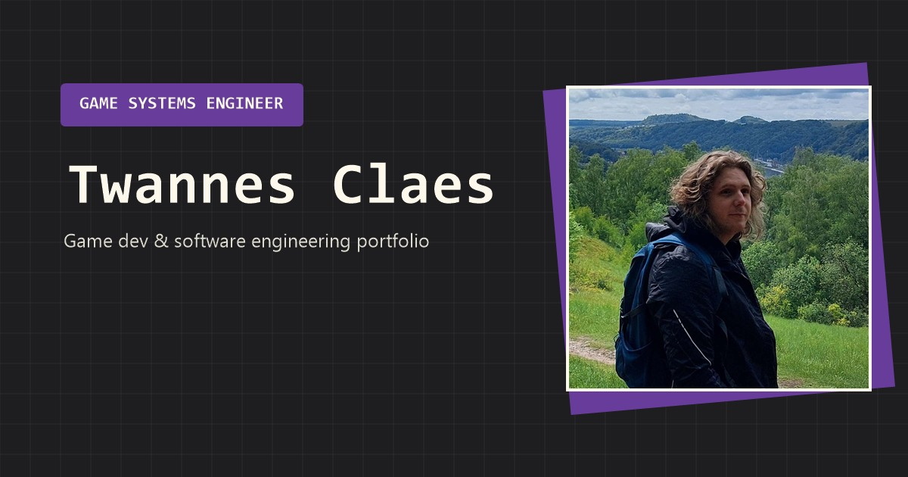

# Portfolio

My personal portfolio: **[twannes-claes.github.io](https://twannes-claes.github.io)**

A collection of the game development and software engineering projects I am most proud of, from my
studies at Digital Arts and Entertainment, my professional work, and my free time.



## Built with

React 19, TypeScript, Tailwind CSS v4 and Vite.

Every page is prerendered to static HTML with
[vite-react-ssg](https://github.com/Daydreamer-riri/vite-react-ssg), so each project has its own
title and link preview, loads fast, and works without JavaScript.

## Running it locally

Requires Node 22 or newer.

```bash
npm install
npm run dev
```

The site is then on <http://localhost:5173>.

| Script              | What it does                  |
| ------------------- | ----------------------------- |
| `npm run dev`       | Dev server with hot reload    |
| `npm run build`     | Static build into `dist/`     |
| `npm run preview`   | Serves the built site locally |
| `npm run typecheck` | TypeScript, no emit           |
| `npm run lint`      | ESLint                        |
| `npm run format`    | Formats everything            |

## Project structure

```
src/content/        All copy and project data, typed
src/components/     Nav, buttons, cards, carousel, gallery
src/pages/          Home, ProjectPage, NotFound
src/hooks/          useTheme, useMediaQuery
src/styles/         Design tokens and component classes
public/assets/      Images, PDFs, cursors
```

Content is fully separated from markup. Everything you read on the site lives in `src/content/`,
and the components only know how to render it.

## Adding a project

1. Create `src/content/projects/<slug>.tsx` exporting a `Project`. Copy an existing one as a
   starting point, and see `src/content/types.ts` for what each field does.
2. Add it to the list in `src/content/projects/index.ts`.

That is the only wiring step. The route and the prerendered page are both generated from that list.
Set `order` to position it within its category, or `active: false` to hide it.

Images go in `public/assets/projects/<slug>/`.

## Theming

`src/styles/index.css` holds the colour tokens. `:root` is the dark palette and `[data-theme=light]`
overrides it, and Tailwind reads both, so utilities like `bg-bg` and `text-accent` resolve per theme
on their own. A small inline script in `index.html` picks the theme before the first paint so there
is no flash of the wrong colours.

## Analytics

Page views go to [GoatCounter](https://www.goatcounter.com), which is cookieless, so the site needs
no consent banner. The snippet in `index.html` counts the page a visitor lands on, and
`src/analytics.ts` reports the navigations that happen without a reload, such as opening a project
from the home page.

The script ignores localhost, so running the site locally does not touch the numbers. The dashboard
is at <https://twannes-claes.goatcounter.com>.

## Code style

4-space indent, single quotes, and braces on their own line, matching the C++ and C# conventions I
use elsewhere. Prettier cannot do the brace placement, so TypeScript is formatted by ESLint instead
(see `eslint.config.ts`) and Prettier handles everything else. `npm run format` runs both.

## Releasing

Day to day work happens on `main`. The live site only updates when `main` is merged into
`release`.

To publish a new version, bump `version.txt`, then merge:

```bash
git checkout release
git merge main
git push
```

[The pipeline](.github/workflows/release.yml) typechecks, lints and builds on both branches, so
`main` always tells you whether the code is healthy. On `release`, if the version in `version.txt`
has no matching tag yet, it also deploys to GitHub Pages and creates the `v1.1.0` tag and a GitHub
Release with notes from the commits since the last one.

Merging without a bump still runs the checks, it just does not deploy. The build must pass before
anything is published, and the tag is only created after the deploy succeeds, so a tag always marks
something that actually went live.
